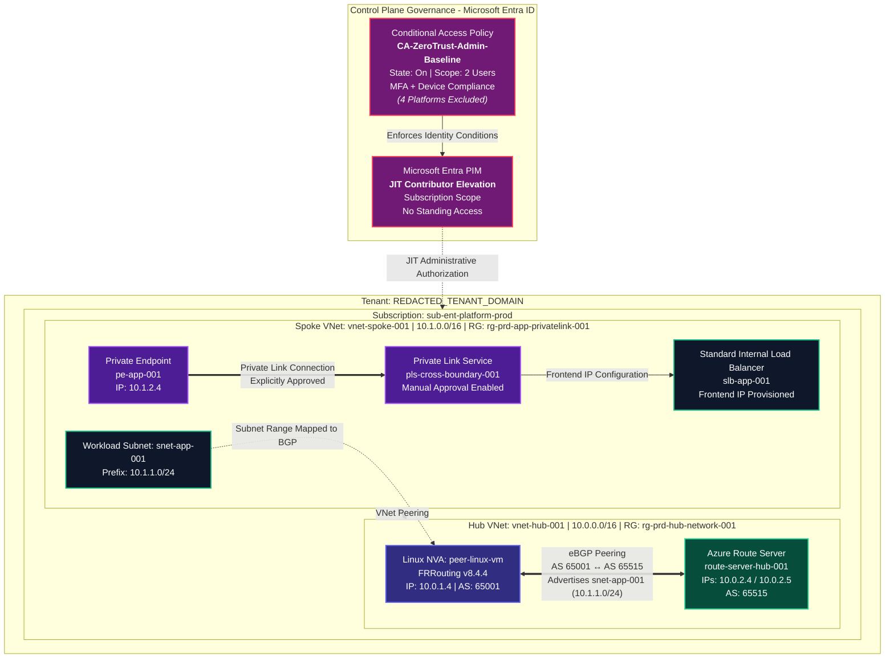

## Zero-Trust Enterprise Landing Zone: Dynamic BGP Routing & Identity Governance
SC-100 designed the security architecture. AZ-700 built the network underneath it. This project is where both certifications meet in one working environment.

## Executive Summary
This repository contains the complete architecture, configuration lifecycle, and low-level CLI validation for an enterprise-grade Zero-Trust Enterprise Landing Zone.

While traditional cloud architectures rely solely on network perimeters, this project integrates Control Plane Security (Privileged Identity Management and Conditional Access baselines) with a Data Plane Infrastructure (eBGP dynamic routing via Linux FRRouting, Azure Route Server, Internal Load Balancers, and Cross-Boundary Private Link Services).




### Core Technical Pillar Highlights


## Real eBGP Convergence: Established bidirectional eBGP route propagation between a Linux VM running FRRouting v8.4.4 (AS 65001) and Azure Route Server (AS 65515). Routes were verified live via FRRouting vtysh and Azure PowerShell.

Linux NVA & BGP Engine Configuration: Leveraged vtysh CLI troubleshooting on peer-linux-vm to overcome default FRR 8.4+ route dropping by injecting a static Null0 RIB route for the workload subnet (10.1.1.0/24), disabling ebgp-requires-policy, and binding outbound route-map PERMIT-ALL policies.

## Cross-Boundary Private Link Service: Deployed pls-cross-boundary-001 with an explicit manual approval workflow, ensuring consumer endpoints cannot auto-approve or gain unauthorized data-plane access.

Isolated Workload Tier: Fronted spoke backend resources using a Standard Internal Load Balancer (slb-app-001), completely isolated from public internet ingress/egress.

## Identity Baseline (CA & PIM): Enforced Conditional Access policy (CA-ZeroTrust-Admin-Baseline) set to On (targeting 2 admin accounts requiring simultaneous MFA and compliant device state). Configured Microsoft Entra PIM for Just-In-Time (JIT) Contributor access at the subscription scope, removing all standing administrative privileges.

### Implementation Phases & Architectural Rationale

## Phase 1: Identity Governance Setup
To satisfy SC-100 zero-trust identity requirements, standing access was completely removed from the environment before network deployment commenced.

Entra ID PIM Activation: Configured JIT Contributor role elevation at subscription level (sub-ent-platform-prod), requiring justification, MFA verification, and ticket correlation upon activation.

Conditional Access Hardening: Implemented CA-ZeroTrust-Admin-Baseline with dual controls enforced simultaneously:

Grant Control 1: Require Multi-Factor Authentication (MFA).

Grant Control 2: Require device to be marked as compliant in Microsoft Intune.

Platform Scope Exception: Four device platforms were deliberately excluded to maintain admin access in a personal tenant without Intune enrollment, targeting the compliance requirement directly at designated workload admin accounts rather than locking out the global admin session itself.

## Phase 2: Hub-and-Spoke & Private Endpoint Isolation
Virtual Network Fabric: Deployed Hub VNet (10.0.0.0/16) and Spoke VNet (10.1.0.0/16) with bi-directional VNet Peering.

Internal Load Balancer & Private Link: Configured slb-app-001 in the spoke network to handle private backend traffic. Attached pls-cross-boundary-001 to the ILB's frontend IP configuration.

Explicit Connection Workflow: Set Private Link Service auto-approval to Disabled, requiring explicit manual approval from resource owners for cross-tenant/cross-boundary endpoint connection requests (pe-app-001).

## Phase 3: Dynamic BGP Routing via FRRouting & Azure Route Server
Deploying Azure Route Server (route-server-hub-001) enabled dynamic prefix exchanges with the Linux NVA (peer-linux-vm).

## Linux FRRouting (vtysh) Shell Configuration
Due to security defaults in FRR 7.5+, eBGP sessions stay Established but fail to advertise routes without explicit RIB insertion and policy mapping. To ensure the advertised prefix mapped directly to an actual resource, the specific workload subnet 10.1.1.0/24 (snet-app-001) inside Spoke VNet (10.1.0.0/16) was bound to Null0 in the local RIB.

The following commands were executed in vtysh to achieve route convergence:

```text
configure terminal
!
ip route 10.1.1.0/24 Null0
!
route-map PERMIT-ALL permit 10
exit
!
router bgp 65001
 neighbor 10.0.2.4 remote-as 65515
 neighbor 10.0.2.4 route-map PERMIT-ALL out
 neighbor 10.0.2.5 remote-as 65515
 neighbor 10.0.2.5 route-map PERMIT-ALL out
 network 10.1.1.0/24
 no bgp ebgp-requires-policy
end
write memory
clear ip bgp 10.0.2.4 soft out
clear ip bgp 10.0.2.5 soft out
```
### Known Gaps & Limitations
Internal Load Balancer Configuration: ILB (slb-app-001) was provisioned with Standard SKU frontend configuration and Private Link Service integration; backend pool members, health probes, and load balancing rules are deferred to the next implementation phase.

### Technical Verification Artifacts
### 1. FRRouting Outbound Advertised Routes
Executing show ip bgp neighbors 10.0.2.4 advertised-routes inside vtysh on peer-linux-vm confirms 10.1.1.0/24 is actively advertised to the Azure Route Server peer:

```text
peer-linux-vm# show ip bgp neighbors 10.0.2.4 advertised-routes
BGP table version is 1, local router ID is 10.0.1.4, vrf id 0
Default local pref 100, local AS 65001
Status codes:  s suppressed, d damped, h history, * valid, > best, = multipath,
               i internal, r RIB-failure, S Stale, R Removed

   Network          Next Hop            Metric LocPrf Weight Path
*> 10.1.1.0/24      0.0.0.0                  0          32768 i

Total number of prefixes 1
```

### 2. Azure Route Server Control Plane Verification
Querying route-server-hub-001 via Azure PowerShell confirms that Azure Route Server accepts and installs the advertised prefix across both redundancy instances (10.0.2.4 and 10.0.2.5):

PowerShell
```text
Get-AzRouteServerPeerLearnedRoute `
  -ResourceGroupName "rg-prd-hub-network-001" `
  -RouteServerName "route-server-hub-001" `
  -PeerName "peer-linux-vm"
```
PowerShell Execution Output:

```text
LocalAddress Network     NextHop  SourcePeer Origin AsPath Weight
------------ -------     -------  ---------- ------ ------ ------
10.0.2.5     10.1.1.0/24 10.0.1.4 10.0.1.4   EBgp   65001  32768 
10.0.2.4     10.1.1.0/24 10.0.1.4 10.0.1.4   EBgp   65001  32768
```


   
    
